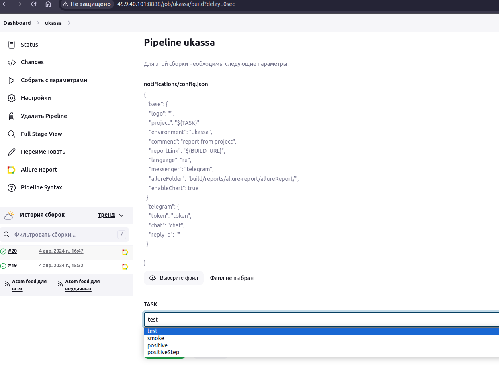
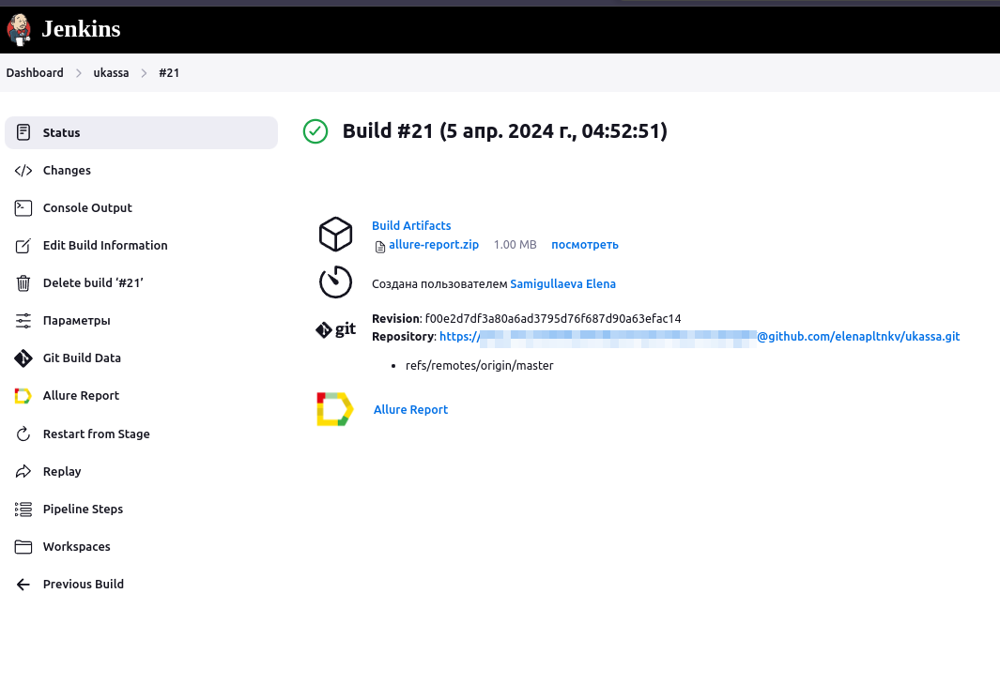
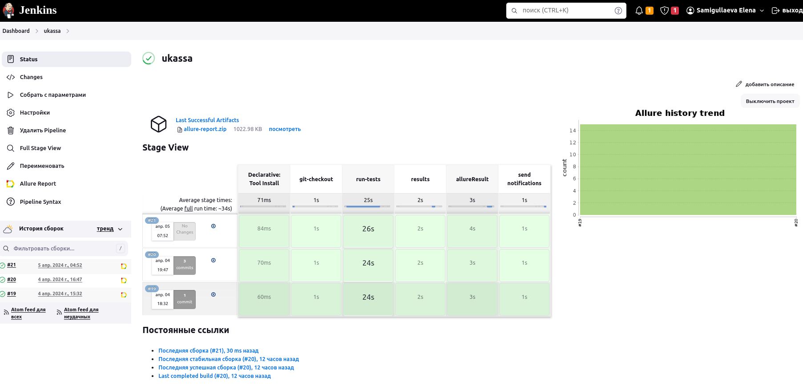
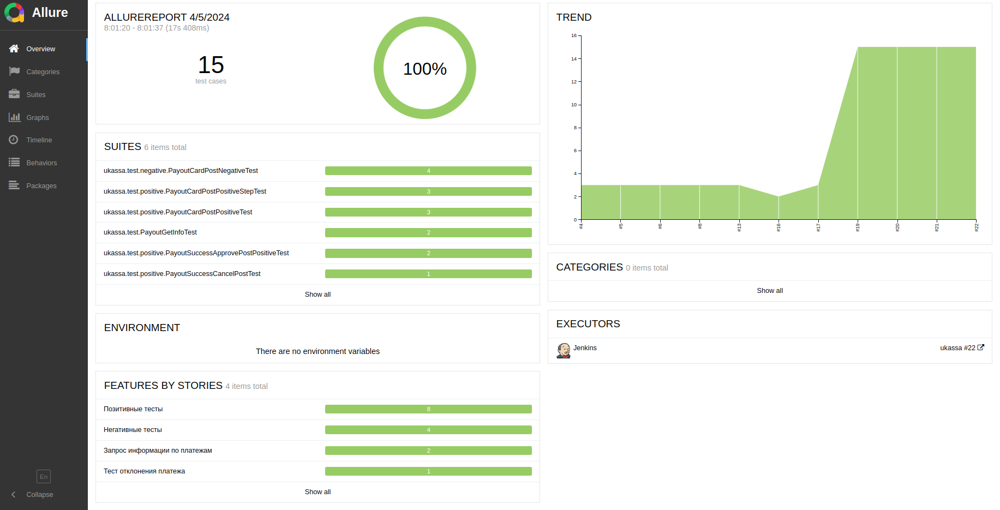
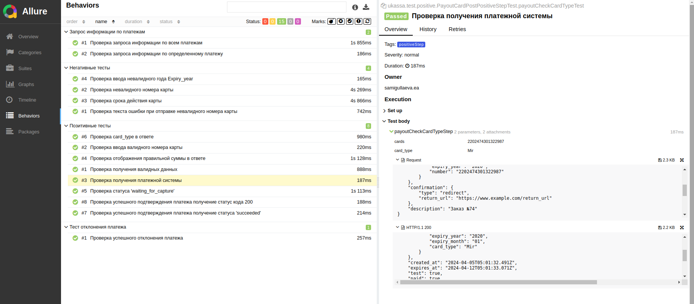
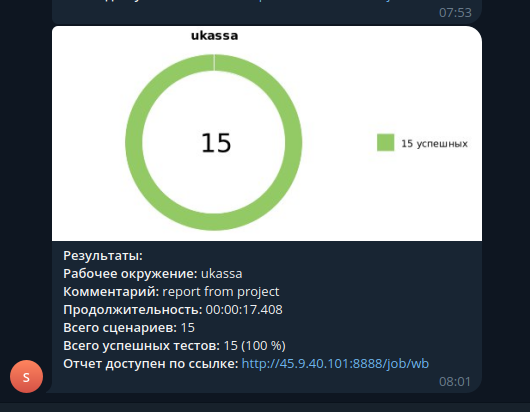

# Демопроект автоматизации тестирования API сервиса для приёма платежей [ЮKassa](https://yookassa.ru/)

## :open_book: Содержание:

- [Технологии и инструменты](#gear-технологии-и-инструменты)
- [Тест кейсы](#heavy_check_mark-Тест-кейсы)
- [Запуск тестов](#computer-запуск-тестов-из-терминала)
- [Примеры использования](#примеры-использования)
- [Запуск тестов в Jenkins](#-запуск-тестов-из-jenkins)
- [Отчет о результатах тестирования в Allure Report](#-отчет-о-результатах-тестирования-в-Allure-report)
- [Уведомления в Telegram](#-уведомления-в-telegram)
- [Видео прохождения тестов](#movie_camera-видео-с-прогоном-тестов)

## :gear: Технологии и инструменты

<p align="left">
<a href="https://www.jetbrains.com/idea/"></a>
<a href="https://www.java.com/"></a>
<a href="https://github.com/"></a>
<a href="https://junit.org/junit5/"></a>
<a href="https://gradle.org/"></a>
<a href="https://rest-assured.io/"></a>
<a href="https://github.com/allure-framework/allure2"></a>
<a href="https://www.jenkins.io/"></a>
<a href="https://web.telegram.org/"></a>
</p>

В данном проекте автотесты написаны на **Java** с использованием фреймворка для тестирования **Selenide**. Для сборки проекта в среде **IntelliJ IDEA** используется **Gradle**.
**JUnit5** задействован в качестве фреймворка модульного тестирования. Запуск тестов выполняется из **Jenkins**. **Selenoid** используется для запуска браузеров в контейнерах **Docker**.

**Allure Report** и **Telegram Bot** используются для визуализации результатов тестирования.

## :heavy_check_mark: Позитивные тест кейсы оплаты банковской карты

- Проверка оплаты банковской картой 
- Проверка подтверждения успешной оплаты
- Проверка отклонения отплаты
- Проверка запроса информации по оплате

## :heavy_check_mark: Негативные тест кейсы оплаты банковской карты

- Проверка ввода невалидного номера банковской карты
- Проверка ввода невалидной даты
- Проверка текста ошибок
- Проверка карты с истекшим сроком 

## :heavy_check_mark: Аутентификация:
Для аутентификации запросов необходимо использовать HTTP Basic Auth.
Ссылка на документацию: https://yookassa.ru/developers/using-api/interaction-format#auth
```
static String originalInput = "Идентификатор магазина:Секретный ключ";
static String encodedString = Base64.getEncoder().encodeToString(originalInput.getBytes(UTF_8));
```


## :heavy_check_mark: Список банковских карт для проверки успешных сценариев:

| НОМЕР            | ТИП КАРТЫ        | 3-D SECURE |
|------------------|------------------|------------|
| 5555555555554444 | Mastercard       | ➖          |
| 6759649826438453 | Maestro          | ➖          |
| 4111111111111111 | Visa             | ➖          |
| 4175001000000017 | Visa Electron    | ➖          |
| 2202474301322987 | Mir              | ➖          |
| 370000000000002  | American Express | ➖          |
| 3528000700000000 | JCB              | ➖          |
| 36700102000000   | Diners Club      | ➖          |


## :heavy_check_mark: Список банковских карт для проверки неуспешных сценариев:
| НОМЕР КАРТЫ                   | ПРИЧИНА ОТМЕНЫ ПЛАТЕЖА        |
|-------------------------------|-------------------------------|
| 5555555555554592 (Mastercard) |                               |
| 4839665499603842 (Visa)       |                               |
| 2200000000000012 (Mir)        | 3d_secure_failed              |
| 5555555555554535 (Mastercard) |                               |
| 4926946416239025 (Visa)       |                               |
| 2200000000000020 (Mir)        | call_issuer                   |
| 5555555555554543 (Mastercard) |                               |
| 4141435412630840 (Visa)       |                               |
| 2200000000000038 (Mir)        | card_expired                  |
| 5555555555554568 (Mastercard) |                               |
| 4483274282299972 (Visa)       |                               |
| 2200000000000046 (Mir)        | fraud_suspected               |
| 5555555555554527 (Mastercard) |                               |
| 4889971706588753 (Visa)       |                               |
| 2202202212312379 (Mir)        | general_decline               |
| 5555555555554600 (Mastercard) |                               |
| 4562265587712390 (Visa)       |                               |
| 2200000000000053 (Mir)        | insufficient_funds            |
| 5555555555554618 (Mastercard) |                               |
| 4951017853630544 (Visa)       |                               |
| 2201382000000013 (Mir)        | invalid_card_number           |


## :computer: Запуск тестов из терминала

### :house_with_garden:	Локальный запуск тестов

```bash
gradle clean test
```
### :earth_asia: Запуск smoke тестов 
```bash
gradle clean smoke
```
### :earth_asia: Запуск позитивных тестов
```bash
gradle clean positive
```

## Примеры использования

##  Запуск тестов из [Jenkins](http://45.9.40.101:8888)
Для запуска сборки необходимо перейти в раздел <code><strong>*Собрать с параметрами*</strong></code> и нажать кнопку <code><strong>*Собрать*</strong></code>.

<p align="center">
  </home/user/IdeaProjects/wb/images/screenshots/2024-03-21_11-57.png" alt="Jenkins" width="800">
</p>

После выполнения сборки, в блоке <code><strong>*История сборок*</strong></code> напротив номера сборки появится
значок *Allure Report* кликнув по которому, откроется страница с сформированным html-отчетом и тестовой документацией.

<p align="center">
  
</p>
<p align="center">
  
</p>

<p align="center">
  
</p>

##  Отчет о результатах тестирования в [Allure Report](http://45.9.40.101:8888/job/wb/179/allure/)

<p align="center">
  
</p>
<p align="center">
  
</p>

##  Уведомление в Telegram
После завершения сборки специальный бот, созданный в <code>Telegram</code>, автоматически обрабатывает и отправляет сообщение с отчетом о прогоне тестов.

<p align="center">


<a id="video"></a>
## </a> Пример прогона тестов в Github

<p align="center">
  
</p>